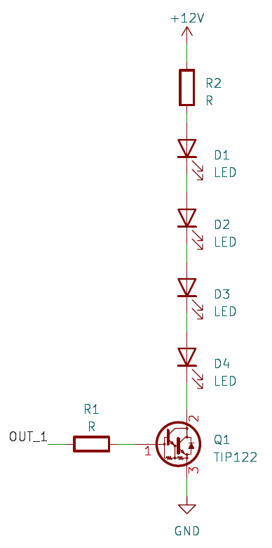
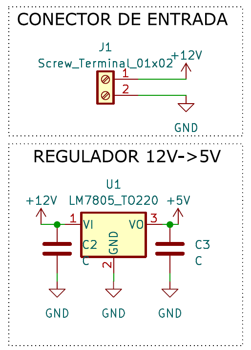
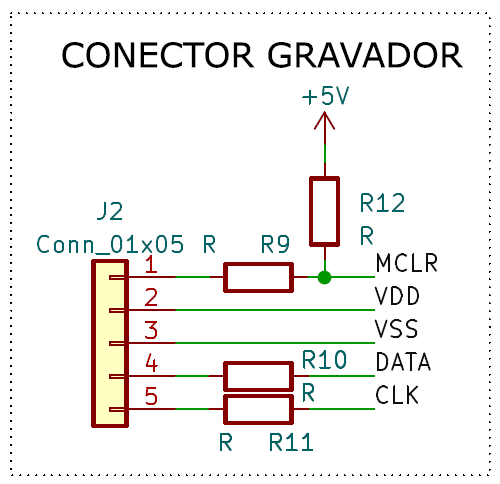
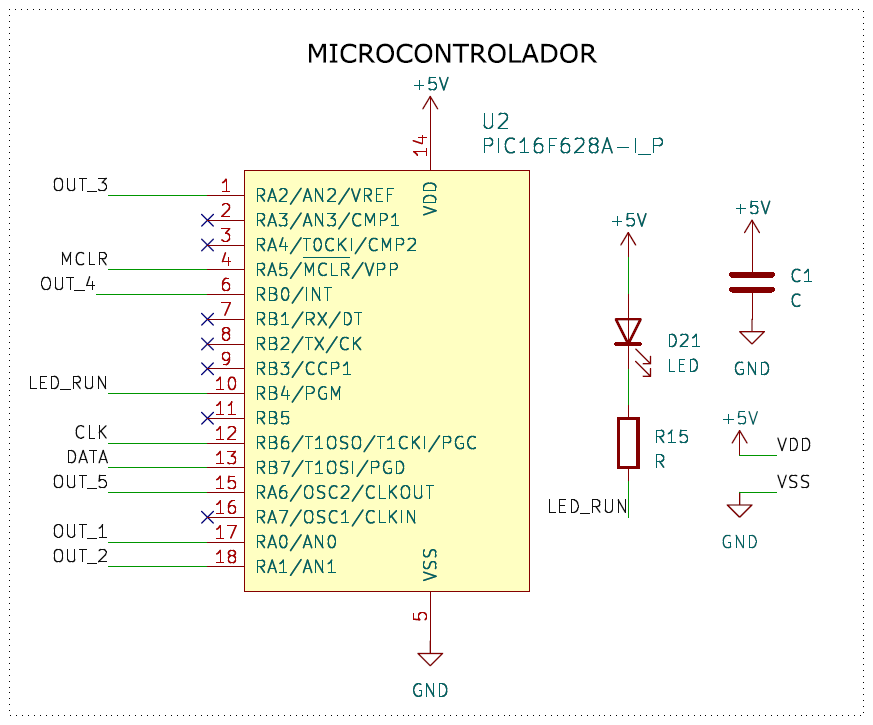
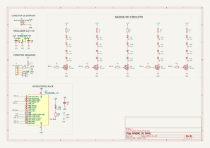

# Árvore de Natal

*******
## Sumário
1. [Materias do Projeto](#materiais-do-projeto-totais)
2. [Módulo de Saídas](#módulo-de-saídas)
3. [Regulador de tensão](#regulador-de-tensão-lm7805)
4. [Gravador Pickit3](#gravador-pickit3)
5. [Microprocessador do circuito](#microprocessador-do-circuito)
6. [Esquemático](#esquemático-do-projeto)
7. [Programa do Projeto](#programa-do-projeto)

*******
## Materiais do Projeto Totais

| Componentes | Quantidades |
| :---: | :---: |
| Fonte DC 12V 1A | 1 |
| Led Vermelho | 7 |
| Led Verde | 6 |
| Led Amarelo | 6 |
| Led Branco | 2 |
| LM7805 | 1 |
| PIC16F628A | 1 |
| TIP121 | 5 |
| 100Ω | 18 |
| 10kΩ | 7 |
| Capacitor 100nF | 2 |
| Capacitor 10nF | 1 |
| Conector KK Macho 5 pinos | 1 |

## Módulo de Saídas

### Componentes Utilizados nesse módulo

| Componentes | Quantidades |
| :---: | :---: |
| Led Vermelho | 7 |
| Led Verde | 6 |
| Led Amarelo | 6 |
| Led Branco | 1 |
| TIP121 | 5 |
| 100Ω | 15 |
| 10kΩ | 5 |

### Desenvolvimento Técnico

Após testes em bancada, viu-se que a corrente para o LED ligar com bastante intensidade é cerca de 50mA. Dessa forma podemos calcular os resistores em série com os leds, para isso serão analisadas os seguintes valores.

| Parâmetro | Corrente de base | Tensão de saturação |
| :---: | :---: | :---: |
| VCEmin(Saturação) | 12mA | 2V |
| VCEmáx(Saturação) | 20mA | 4V |
| VBE | - | 2,5V |

E levando em conta o ganho do TIP121 sendo:

$$
hfe=1000
$$

Para calcular o máximo de corrente no coletor do transistor, será necessário calcular qual a corrente da base, sendo a equação a tensão da saída do micro controlador(Vsaida) menos a tensão de base para emissor(VBE)dividida por uma resistência de base(Rbase).

$$
I_{\text{Coletor}} = \frac{V_{\text{saida}}-{V_{\text{BE}}}}{R_{\text{base}}}
$$

Os valores definidos foram:

$$
V_{\text{saída}} = 5V
$$

$$
R_{\text{base}} = 10k\Omega
$$

Sendo assim o valor da corrente de coletor seria:

$$
I_{\text{Coletor}} = \frac{5 - 2.5}{10\text{k}\Omega}
$$

$$
I_{\text{Coletor}}=250\mu A
$$

Considerando essa corrente, pode-se verificar que com um ganho de 1000, teria no máximo de corrente para o coletor de 250mA, sendo mais que o suficiente para o consumo previsto de 50mA.

Para calcular o resistor em série com os Leds levou-se em consideração os seguintes parâmetros:

$$
\text{Queda de tensão do LED} (V_{\text{LED}}) = 2V
$$

$$
\text{Corrente do LED} (I_{\text{LED}}) = 55mA
$$

$$
V_{\text{CEmin (Saturação)}} = 2V
$$

Considerando 4 Leds por transistor, teremos a seguinte equação para calcular a resistência do coletor(Rcoletor) que está em série com os Leds.

$$
R_{\text{coeltor}} = \frac{V_{\text{CC}}-(4 \times V_{\text{LED}})-V_{\text{CEmin(saturação)}}}{I_{\text{LED}}}
$$

$$
R_{\text{coletor}} = \frac{12-8-2}{55m}
$$

$$
R_{\text{coletor}}=36\Omega
$$

Dessa forma obtemos o valor da resistência a qual deve ser próxima para gerar a corrente necessária para os Leds. Como possuímos mais resistores de 100Ω, serão utilizados 2(dois) em paralelo.

$$
R_{\text{coletor}}=100//100//100\rightarrow\frac{1}{R_{\text{coletor}}}=\frac{1}{100}+\frac{1}{100}+\frac{1}{100}
$$

$$
\frac{1}{R_{\text{coletor}}}=\frac{3}{100}
$$

$$
R_{\text{coletor}}=33,3333\Omega
$$

Por essa razão serão utilizados somente resistores de 100Ω.

## Regulador de tensão LM7805

### Componentes Utilizados nesse módulo

| Componentes | Quantidades |
| :---: | :---: |
| Fonte DC 12V 1A | 1 |
| LM7805 | 1 |
| Capacitor 100nF | 2 |

### Desenvolvimento Técnico

O uso do 7805 foi projetado à corrente consumida pelo micro controlador e as suas portas para o acionamento das saídas.

Sendo assim foi seguida a montagem básica do 7805, com capacitor na entrada e saída.

## Gravador PICKIT3

### Componentes Utilizados nesse módulo

| Componentes | Quantidades |
| :---: | :---: |
| Resistor 10kΩ | 1 |
| Resistor 100Ω | 3 |
| Conector KK Macho 5 pinos | 1 |

### Desenvolvimento Técnico

Para realizar a gravação, seguiu-se o especificado no datasheet, colocando resistores entre os pinos e deixando o MCLR em nível baixo.

## Microprocessador do circuito

### Componentes Utilizados nesse módulo

| Componentes | Quantidades |
| :---: | :---: |
| Led Branco | 1 |
| PIC16F628A | 1 |
| Capacitor 10nF | 1 |
| Resistor 10kΩ | 1 |

### Desenvolvimento Técnico

Para a montagem do micro controlador levou-se em consideração as especificações do datasheet, e a sua montagem foi respeitando somente uma função para cada pino. 

## Esquemático do projeto

## Programa do projeto
O programa do projeto resume-se em uma função para iniciar o microprocessador e definir os pinos e clocks, após isso inicia-se a rotina para atualizar as saídas a cada múltiplo de 100ms, e através disso ocorre a piscada dos leds.

[**Link do Código**](https://github.com/Hiemer23/Arvore/tree/main/Arvore.X)
